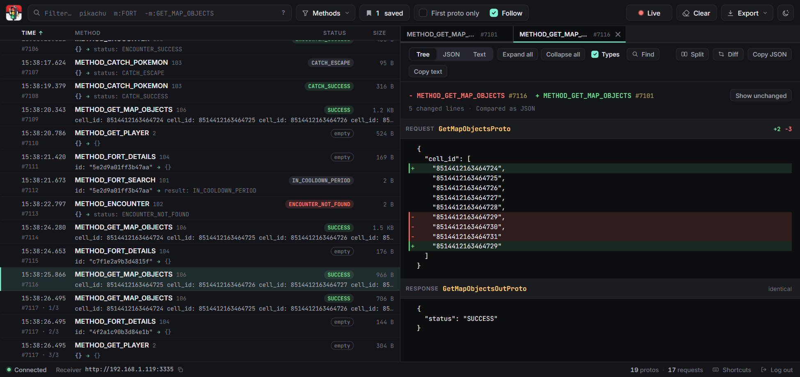

<p align="center">
  
</p>

<h1 align="center">Traffic Light</h1>

<p align="center">
  <strong>Beautiful traffic logging for PGO</strong><br />
  Every request the game makes, decoded in real time, in your browser or your terminal.
</p>

<p align="center">
  
  
  
  
</p>

<p align="center">
  <a href="#quick-start">Quick start</a> ·
  <a href="#the-web-ui">Web UI</a> ·
  <a href="#the-terminal-ui">Terminal UI</a> ·
  <a href="#configuration">Configuration</a> ·
  <a href="#installation">Installation</a> ·
  <a href="#writing-a-mitm">Writing a MITM</a>
</p>

> [!NOTE]
> This is a modified fork of [ccev/TrafficLight](https://github.com/ccev/TrafficLight) with support for a
> [web UI](#the-web-ui).


## What it is

A MITM app on your phone POSTs every request the game makes to Traffic Light. Traffic Light decodes
the protobufs and shows them as they arrive, so you can see exactly what is going on while you play.

It comes as a CLI with a couple of extra utilities:

| command | what it does |
| --- | --- |
| `trafficlight run` | start the receiver and the output you picked in your config |
| `trafficlight show MESSAGENAME` | print the definition of any Message or Enum, with fuzzy matching |

## Quick start

```sh
git clone https://github.com/ccev/TrafficLight && cd TrafficLight
cp config.example.toml config.toml     # set output = "web"
uv run trafficlight run
```

The web UI opens at <http://127.0.0.1:3336>. Point your MITM's POST destination at
`http://{your computer's IP}:3335` and traffic starts showing up.

No uv? See [Installation](#installation) for pipx, Poetry and Docker.

## The web UI

Set `output = "web"` and Traffic Light opens a page in your browser instead of the terminal UI.

The log lists one row per Proto, with the response status (`ENCOUNTER_SUCCESS`, `OUT_OF_RANGE`, …),
the size, the time of day and how long after the request before it this one arrived. Click the
header to sort by any column, or the `Δ` next to **Time** to show gaps instead of the clock.

### Filtering

Type in the filter box. Every term has to match, and keys work with `-` and quotes too.

| term | matches |
| --- | --- |
| `encounter` | the method, a message name or the content contains it |
| `"two words"` | exact phrase |
| `-telemetry` | exclude |
| `m:FORT` `method:FORT` | method name or number |
| `msg:FortDetails` | request or response message name |
| `s:ERROR` `status:ERROR` | status or result of the response |
| `is:saved` | also `is:proxy`, `is:error`, `is:ok`, `is:empty`, `is:unknown` |
| `/pika(chu)?/` | regular expression |

Values after `method:`, `msg:`, `status:` and `is:` autocomplete. **Methods** shows how often each
method was called so you can hide the noisy ones, or show only the one you care about.

### Keeping requests

The log only holds the newest `web_max_records` requests. **Save** one and it is never the one
dropped, it survives **Clear**, and it stays inspectable for as long as Traffic Light runs. Press
`b` or use the bookmark on the left of a row. At most half the limit can be saved, so there is
always room for new traffic.

### Several Protos at once

Every Proto you open gets a tab. `Ctrl` or middle click opens one in a background tab, a double
click opens one that stays. **Split** shows two side by side, each with its own Tree/JSON/Text
view, and **Diff** compares the pair line by line.



### Reading one Proto

The Inspect View is a collapsible tree with field types, enum names and their values, or the plain
JSON and Text. `Ctrl`+`F` searches inside the Proto you are reading: it counts the matches, `Enter`
steps through them, and **Matches only** hides every field that does not match. It works in all
three views.

Lost your place in the log? A pill brings you back to the Proto you are inspecting, and so does `g`.

### Getting data out

Copy any message as JSON, Text or base64, copy a link to a Proto, or export the whole log, just what
the filter shows, or just the saved requests. Exports use the same format MITMs send, so you can
POST one back to Traffic Light later and read it again.

### Keyboard

Press `?` in the app for this list.

| key | action | key | action |
| --- | --- | --- | --- |
| `/` `Ctrl`+`K` | filter | `p` | pause capturing |
| `↑` `↓` `j` `k` | previous / next | `f` | follow new requests |
| `Home` `End` | first / last | `1` | first Proto only |
| `g` | back to the selected Proto | `b` | save or unsave |
| `Enter` | open in a tab that stays | `w` | close the tab |
| `[` `]` | previous / next tab | `Ctrl`+`F` | find in this Proto |
| `n` | next match | `t` | Tree / JSON / Text |
| `m` | methods | `h` | hide the inspected method |
| `c` | copy inspected as JSON | `?` | help |

### Opening it from another device

By default the page only opens on your own computer. Set `web_host = "0.0.0.0"` to reach it from
elsewhere on your network.

> [!IMPORTANT]
> Set `web_password` before you put the web UI on the internet. It then asks for that password;
> logins last 30 days and changing the password logs everyone out.

A password is also what lets you open it through a domain. Without one, only localhost and IP
addresses work, so no website can read your traffic through DNS rebinding. Behind a reverse proxy,
keep the original Host header — Coolify and Caddy do, nginx needs `proxy_set_header Host $host;`.

## The terminal UI

The default output is a full UI in your terminal.


There's a log of all captured requests on the left. You can click on any Proto to open it in the
Inspect View to analyze it further.


By pressing `>`, `ENTER` or `RETURN` (or by simply clicking on the left button) you enter the
Command Input. Here you can choose between a set of useful controls, either by pressing the
specified key or by clicking on it.

- **Filters**
  - **Text:** filters Method names, Message names and body. Also highlights the search string in Inspect View
  - **Methods:** (with autocomplete!) filter by method names, i.e. `METHOD_FORT_DETAILS` or `SOCIAL_ACTION_GET_INBOX`
  - **Messages:** (with autocomplete!) filter by message names, i.e. `GetMapObjectsProto` or `EncounterOutProto`
- **Pause:** ignores incoming requests
- **First Proto Only:** in most requests, only the first entry/"Proto" matters. This helps clear the clutter
- **Follow:** scrolls the Log to show new incoming requests
- **Empty Log:** clears the Log
- **Copy Inspected:** copies the text from the Inspect View

## Forwarding

Set `forward_url` and Traffic Light passes every request it receives on to that endpoint as well,
i.e. a Golbat's `http://127.0.0.1:9001/raw`. Point your MITM at Traffic Light and Traffic Light at
your scanner, and you can inspect traffic without taking the endpoint away from it. Set
`forward_token` to send a bearer token with every request.

The body goes on untouched, so the other end sees exactly what your MITM sent. Forwarding is fire
and forget: your MITM is answered without waiting for the other end, nothing is ever retried, and an
endpoint that is down or slow costs you the forwarded requests and nothing else. Traffic Light says
so once when forwarding starts failing, and once when it works again.

## Other outputs

There's also an option to simply print all requests (`output = "print"`) or send them to Discord
(`output = "discord"` with a `webhook`). You can use those if you don't like the UI.

## Configuration

Copy `config.example.toml` to `config.toml`. Every option can also be set as an environment
variable, i.e. `TRAFFICLIGHT_OUTPUT=web`, and those win over the file.

| option | default | what it does |
| --- | --- | --- |
| `host` `port` | `0.0.0.0` `3335` | where the receiver listens for your MITM |
| `output` | `ui` | `ui`, `web`, `print` or `discord` |
| `forward_url` | empty | also pass every request on to this endpoint |
| `forward_token` | empty | bearer token sent with the forwarded request |
| `webhook` | empty | Discord webhook, for `output = "discord"` |
| `web_host` `web_port` | `127.0.0.1` `3336` | where the web UI listens. `0.0.0.0` opens it to your network |
| `web_password` | empty | makes the web UI ask for a password |
| `web_max_records` | `5000` | how many requests the web UI keeps |
| `web_open_browser` | `true` | open a browser when Traffic Light starts |

## Installation

Traffic Light is made to run on your own computer, next to the phone you are playing on.

### pipx or uv

```sh
pipx install git+https://github.com/ccev/TrafficLight
```

pipx is the one to use — install it with `pip install pipx` if you don't have it, or use plain pip
if you prefer. With [uv](https://docs.astral.sh/uv/), run `uv tool install` with the same URL.

The `trafficlight` command is then on your PATH. Running it opens the receiver on port `3335`, and
you can point a supported MITM at it.

### From a clone

Clone the repo, copy `config.example.toml` to `config.toml` and fill it out. You need Python 3.11,
3.12 or 3.13.

With [uv](https://docs.astral.sh/uv/getting-started/installation/) — it installs everything and
picks a fitting Python for you:

```sh
uv run trafficlight run
```

Or with [Poetry](https://python-poetry.org/docs/#installation):

```sh
poetry install
poetry run trafficlight run
```

Then set your MITM's POST destination to your endpoint from `config.toml`, by default
`http://{computer IP}:3335`.

### Docker

```sh
docker compose up --build
```

The web UI is at <http://localhost:3336> and your MITM posts to `http://{computer IP}:3335`. Set any
option from `config.example.toml` as an environment variable in `compose.yaml`, i.e.
`TRAFFICLIGHT_OUTPUT=discord` and `TRAFFICLIGHT_WEBHOOK=...`, or mount your own `config.toml` the way
that file shows.

### Coolify

- Create an application from this repository with the `Dockerfile` build pack
- **Ports Exposes:** `3336`, the web UI that Coolify puts behind your domain
- **Ports Mappings:** `3335:3335`, so your MITM can reach the receiver at `http://{server IP}:3335`
- **Environment variables:** `TRAFFICLIGHT_WEB_PASSWORD`, since your domain is public

## Writing a MITM

To support Traffic Light, a MITM only has to POST a body like this to the receiver for every request
the game makes. It should run alongside the game, so you can play normally while inspecting traffic.

```json
{
    "rpcid": 1,
    "rpcstatus": 1,
    "rpchandle": 1, // optional field
    "protos": [
        {
            "method": 1,
            "request": "<b64 encoded string>",
            "response": "<b64 encoded string>"
        },
        {
            "method": 106,
            "request": "",
            "response": ""
        }
    ]
}
```

## Development

The browser side is plain ES modules in `trafficlight/web/static/js` with no build step — edit a
file and reload the page. They are type checked through JSDoc, and the server's record keeping has
tests:

```sh
npx tsc -p trafficlight/web/static/jsconfig.json
uv run python tests/test_web_server.py
```

## Terminal compatibility

The terminal UI uses [Textual](https://github.com/Textualize/textual). From their docs:

> **Linux (all distros)** — all Linux distros come with a terminal emulator that can run Textual apps.
>
> **macOS** — the default terminal app is limited to 256 colors. We recommend installing a newer
> terminal such as iTerm2, Kitty, or WezTerm.
>
> **Windows** — the new Windows Terminal runs Textual apps beautifully.
