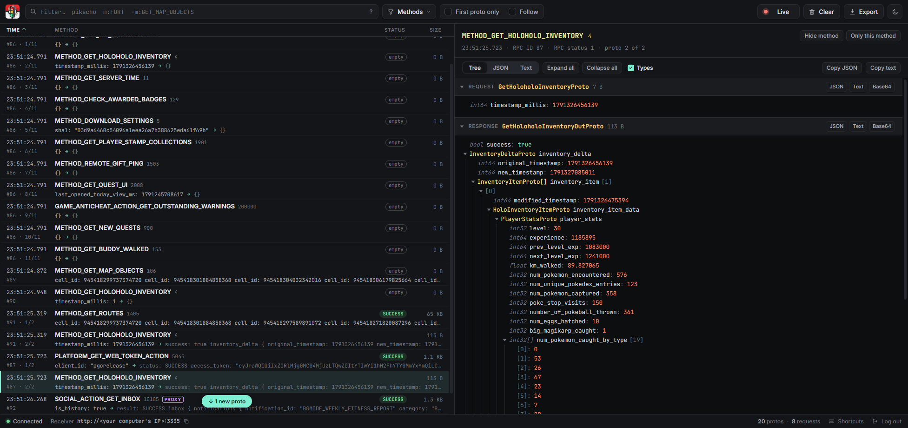

<p align="center">
  
</p>

<h1 align="center">Traffic Light</h1>

<p align="center">
  <strong>Beautiful traffic logging for PGO</strong><br />
  Every request the game makes, decoded in real time, in your terminal or your browser.
</p>

<p align="center">
  
  
  
  
</p>

<p align="center">
  <a href="#web-ui">Web UI</a> · <a href="#tui">TUI</a> · <a href="#installation">Installation</a> · <a href="#docker">Docker</a> · <a href="#supporting-mitms">Supporting MITMs</a>
</p>

> [!NOTE]
> This is a modified fork of [ccev/TrafficLight](https://github.com/ccev/TrafficLight) with support for a 
> [web UI](#web-ui).

## Features

Traffic Light takes specially formatted data from a mitm app and displays them in real-time, 
allowing to see exactly what's going on.

It comes bundled in a CLI that offers a few more utilities.

### TUI

The tool comes with a fully featured UI running in your Terminal.


There's a log of all captured requests on the left. You can click on any Proto to open it 
in the Inspect View to analyze it further.


By pressing `>`, `ENTER` or `RETURN` (or by simply clicking on the left button) you enter 
the Command Input. Here you can choose between a set of useful controls, either by pressing 
the specified key or by clicking on it.

- Filters
  - Text: Filters Method names, Message names and body. Also highlights the search string in 
Inspect View
  - Methods: (with autocomplete!) Filter by method names, i.e. `METHOD_FORT_DETAILS` 
or `SOCIAL_ACTION_GET_INBOX` 
  - Messages: (with autocomplete!) Filter by message names, i.e. `GetMapObjectsProto` 
or `EncounterOutProto`
- Pause: Ignores incoming requests
- First Proto Only: In most requests, only the first entry/"Proto" matters. This helps clear 
the clutter
- Follow: Scrolls the Log to show new incoming requests
- Empty Log: Clears the Log
- Copy Inspected: Copies the text from the Inspected View

### Web UI

Set `output = "web"` in your config and Traffic Light opens a page in your browser 
(http://127.0.0.1:3336 by default) instead of the TUI.



- A live log that shows the response status of every Proto (i.e. `ENCOUNTER_SUCCESS`) and its size
- Filter: Text searches method names, message names and content. Narrow it down with `method:` (or `m:`), 
`msg:` and `status:` (or `s:`), exclude with `-`, use `"quotes"` for phrases and `/.../` for regular expressions, 
i.e. `-m:GET_MAP_OBJECTS status:ERROR`. Values after `method:`, `msg:` and `status:` autocomplete
- Methods: See how often every method was called. Hide the noisy ones or only show the ones you care about
- Inspect View: A collapsible tree with field types, enum names and their values, or the plain JSON and Text. 
Search matches are highlighted and expanded
- Copy any message as JSON, Text or base64, or export the whole log. Exports use the same format MITMs send, 
so you can post them to Traffic Light again
- Pause, Follow, First Proto Only and Clear work like in the TUI. Press `?` to see every keyboard shortcut

By default, the page can only be opened on your computer. Set `web_host = "0.0.0.0"` to open it from other devices. 
`web_max_records` sets how many requests are kept (default: 5000).

Set `web_password` before you make the web UI reachable from the internet, it then asks for that password. Logins 
last 30 days and changing the password logs everyone out. A password is also what lets you open it through a domain: 
without one, only localhost and IP addresses work, so no website can read your traffic through DNS rebinding. 
Behind a reverse proxy, keep the original Host header (Coolify and Caddy do, nginx needs `proxy_set_header Host $host;`).

### Legacy Outputs

There's also an option to simply print all requests or send them to Discord. You can use those 
if you don't like the UI.

## TrafficLight CLI

- `trafficlight run` to run the TUI (or the output you set in your config)
- `trafficlight show MESSAGENAME` to show the definition for any Message to Enum. Uses fuzzy search to display 
the closest match

## Installation

- The TUI is made to be used on your local computer with a local phone

### Install using pipx (or pip)

- `pipx install git+https://github.com/ccev/TrafficLight`
  - I highly recommend using pipx. You can install it using `pip install pipx`. If you prefer, you can also use pip instead
  - With [uv](https://docs.astral.sh/uv/), run `uv tool install` with the same URL instead
- If you installed pipx correctly, the `trafficlight` command will now be available in your PATH
- Running the TUI opens its endpoint at port `3335` of your computer. You can now open a supported MITM on your phone.

### Locally

- Clone repo, copy `config.example.toml` to `config.toml`, fill out the config
- Make sure you use python 3.11, 3.12 or 3.13
- With [uv](https://docs.astral.sh/uv/getting-started/installation/): run `uv run trafficlight run` in your TrafficLight 
root directory. The first run installs everything, and uv picks a fitting Python version for you
- With Poetry: [install Poetry](https://python-poetry.org/docs/#installation) if you haven't already, run `poetry install`, 
then `poetry run trafficlight run` in your TrafficLight root directory
- Open a supported MITM on your phone. Set POST destination to your endpoint from config.toml
(default: http://{computer IP}:3335)

### Docker

- Run `docker compose up --build` in your TrafficLight root directory
- Open the web UI at http://localhost:3336 and set your MITM's POST destination to http://{computer IP}:3335
- Every option from `config.example.toml` can also be set as an environment variable, i.e. `TRAFFICLIGHT_OUTPUT=discord` 
and `TRAFFICLIGHT_WEBHOOK=...`. Set them in `compose.yaml`, or mount your `config.toml` like shown there

### Coolify

- Create an application from this repository with the `Dockerfile` build pack
- Ports Exposes: `3336`, that's the web UI Coolify puts behind your domain
- Ports Mappings: `3335:3335`, so your MITM can reach the receiver at http://{server IP}:3335
- Environment variables: `TRAFFICLIGHT_WEB_PASSWORD`, since your domain is public

### Supporting MITMs

If you want your own MITM to support Traffic Light, all it needs to do is for every request the game makes, 
send a POST request to a specified endpoint with the body looking as follows. It should run alongside 
the game, so you can play it normally while inspecting the traffic.

```json
{
    "rpcid": 1,
    "rpcstatus": 1,
    "rpchandle": 1, // optional field
    "protos": [
        {
            "method": 1,
            "request": "<b64 encoded string>",
            "response": "<b64 encoded string>"
        },
        {
            "method": 106,
            "request": "",
            "response": ""
        }
    ]
}
```

### Additional notes on TUI compatibility

The TUI uses [Textual](https://github.com/Textualize/textual). 
Here's a copy from their docs on platform compatibility.

> ### Linux (all distros)
>All Linux distros come with a terminal emulator that can run Textual apps.
> ### MacOS
>The default terminal app is limited to 256 colors. We recommend installing a newer terminal such as iterm2, Kitty, or WezTerm.
> ### Windows
> The new Windows Terminal runs Textual apps beautifully.
